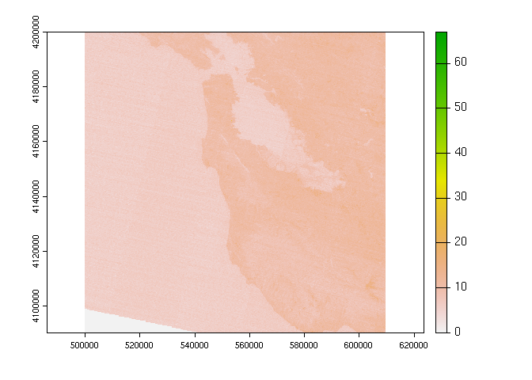

<!-- README.md is generated from README.Rmd. Please edit that file -->

# terragee

<!-- badges: start -->
<!-- badges: end -->

The goal of {terragee} is to help with extension and testing of the
{terra} package in use cases involving GDAL drivers for Google Earth
Engine assets.

-   **EEDA** \<<https://gdal.org/drivers/vector/eeda.html>\>

-   **EEDAI** \<<https://gdal.org/drivers/raster/eedai.html>\>

## Installation

You can install the development versions of {terra} and {terragee} like
so:

``` r
install.packages("terra", repos = "http://rspatial.r-universe.dev/")
remotes::install_github("brownag/terragee")
```

## Example

This example shows how to access a Google Earth Engine Image or
ImageCollection with {terragee}.

``` r
library(terragee)
```

### Set Google Application Credentials

``` r
set_google_application_credentials("~/example-gizmo-999999-999999999999.json")
```

### `EEImage`

``` r
# returns SpatRaster
x <- EEImage("projects/earthengine-public/assets/COPERNICUS/S2/20170430T190351_20170430T190351_T10SEG")
#> Warning: [rast] skipped sub-datasets (see 'desc(sds=TRUE)'):
#> B2,B3,B4,B8,QA10, B5,B6,B7,B8A,B11,B12,QA20
terra::plot(x[[3]])
```



### `EEImageCollection`

``` r
# returns SpatRasterCollection (many SpatRaster, multiple per asset, one for each subdataset)
x <- EEImageCollection("projects/earthengine-public/assets/COPERNICUS/S2", n = 3)
lapply(x, function(x) x)
#> [[1]]
#> class       : SpatRaster 
#> dimensions  : 1830, 1830, 4  (nrow, ncol, nlyr)
#> resolution  : 60, 60  (x, y)
#> extent      : 3e+05, 409800, 2990220, 3100020  (xmin, xmax, ymin, ymax)
#> coord. ref. : WGS 84 / UTM zone 31N (EPSG:32631) 
#> source      : 20150627T102531_20160606T223605_T31RCL:B1,B9,B10,QA60 
#> names       : B1, B9, B10, QA60 
#> 
#> [[2]]
#> class       : SpatRaster 
#> dimensions  : 10980, 10980, 5  (nrow, ncol, nlyr)
#> resolution  : 10, 10  (x, y)
#> extent      : 3e+05, 409800, 2990220, 3100020  (xmin, xmax, ymin, ymax)
#> coord. ref. : WGS 84 / UTM zone 31N (EPSG:32631) 
#> source      : 20150627T102531_20160606T223605_T31RCL:B2,B3,B4,B8,QA10 
#> names       : B2, B3, B4, B8, QA10 
#> 
#> [[3]]
#> class       : SpatRaster 
#> dimensions  : 5490, 5490, 7  (nrow, ncol, nlyr)
#> resolution  : 20, 20  (x, y)
#> extent      : 3e+05, 409800, 2990220, 3100020  (xmin, xmax, ymin, ymax)
#> coord. ref. : WGS 84 / UTM zone 31N (EPSG:32631) 
#> source      : 20150627T102531_20160606T223605_T31RCL:B5,B6,B7,B8A,B11,B12,QA20 
#> names       : B5, B6, B7, B8A, B11, B12, ... 
#> 
#> [[4]]
#> class       : SpatRaster 
#> dimensions  : 1830, 1830, 4  (nrow, ncol, nlyr)
#> resolution  : 60, 60  (x, y)
#> extent      : 3e+05, 409800, 3090240, 3200040  (xmin, xmax, ymin, ymax)
#> coord. ref. : WGS 84 / UTM zone 31N (EPSG:32631) 
#> source      : 20150627T102531_20160606T223605_T31RCM:B1,B9,B10,QA60 
#> names       : B1, B9, B10, QA60 
#> 
#> [[5]]
#> class       : SpatRaster 
#> dimensions  : 10980, 10980, 5  (nrow, ncol, nlyr)
#> resolution  : 10, 10  (x, y)
#> extent      : 3e+05, 409800, 3090240, 3200040  (xmin, xmax, ymin, ymax)
#> coord. ref. : WGS 84 / UTM zone 31N (EPSG:32631) 
#> source      : 20150627T102531_20160606T223605_T31RCM:B2,B3,B4,B8,QA10 
#> names       : B2, B3, B4, B8, QA10 
#> 
#> [[6]]
#> class       : SpatRaster 
#> dimensions  : 5490, 5490, 7  (nrow, ncol, nlyr)
#> resolution  : 20, 20  (x, y)
#> extent      : 3e+05, 409800, 3090240, 3200040  (xmin, xmax, ymin, ymax)
#> coord. ref. : WGS 84 / UTM zone 31N (EPSG:32631) 
#> source      : 20150627T102531_20160606T223605_T31RCM:B5,B6,B7,B8A,B11,B12,QA20 
#> names       : B5, B6, B7, B8A, B11, B12, ... 
#> 
#> [[7]]
#> class       : SpatRaster 
#> dimensions  : 1830, 1830, 4  (nrow, ncol, nlyr)
#> resolution  : 60, 60  (x, y)
#> extent      : 399960, 509760, 2990220, 3100020  (xmin, xmax, ymin, ymax)
#> coord. ref. : WGS 84 / UTM zone 31N (EPSG:32631) 
#> source      : 20150627T102531_20160606T223605_T31RDL:B1,B9,B10,QA60 
#> names       : B1, B9, B10, QA60 
#> 
#> [[8]]
#> class       : SpatRaster 
#> dimensions  : 10980, 10980, 5  (nrow, ncol, nlyr)
#> resolution  : 10, 10  (x, y)
#> extent      : 399960, 509760, 2990220, 3100020  (xmin, xmax, ymin, ymax)
#> coord. ref. : WGS 84 / UTM zone 31N (EPSG:32631) 
#> source      : 20150627T102531_20160606T223605_T31RDL:B2,B3,B4,B8,QA10 
#> names       : B2, B3, B4, B8, QA10 
#> 
#> [[9]]
#> class       : SpatRaster 
#> dimensions  : 5490, 5490, 7  (nrow, ncol, nlyr)
#> resolution  : 20, 20  (x, y)
#> extent      : 399960, 509760, 2990220, 3100020  (xmin, xmax, ymin, ymax)
#> coord. ref. : WGS 84 / UTM zone 31N (EPSG:32631) 
#> source      : 20150627T102531_20160606T223605_T31RDL:B5,B6,B7,B8A,B11,B12,QA20 
#> names       : B5, B6, B7, B8A, B11, B12, ...
```

## On the scope and intent of this package…

Providing a simple interface to major features of {terra} and Google
Earth Engine assets is the primary goal, even when it means
(occasionally) sacrificing backward compatibility.

The API of this simple and experimental package is not guaranteed to be
stable at any time in the near future. There are currently no plans to
pursue CRAN submission. The focal point of development is to
incrementally provide the most convenient wrappers that demonstrate
basic functionality.

In the event that features of GDAL, {terra} or the Earth Engine API
significantly improve (in terms of how Google Earth Engine results are
handled, behavior of `SpatRaster` / `SpatRasterCollection` /
`SpatVector` / `SpatVectorProxy` objects, etc.), compatibility with
prior versions of {terra} will not be guaranteed. Whenever needed the
minimum required {terra} version will be incremented to stay in sync
with changes and alert users of the need to update. Support for the
latest {terra} on CRAN and relative stability with current development
version on
[R-Universe](https://rspatial.r-universe.dev/ui#package:terra) is about
the extent of what can be “expected” to work.

Running with a version of GDAL newer than that included in the latest
Windows RTools or available via R-Universe should be regarded as
experimental. Older versions of GDAL (prior to \~2.4.x) are not
supported as they do not have the required EEDA/EEDAI drivers. In
general it can be expected that modern versions of GDAL are compatible
with {terragee}… but specific operations may have additional
dependencies. For instance, spatial predicates in the OGR `query`
argument requires GDAL be built with *Spatialite*).
